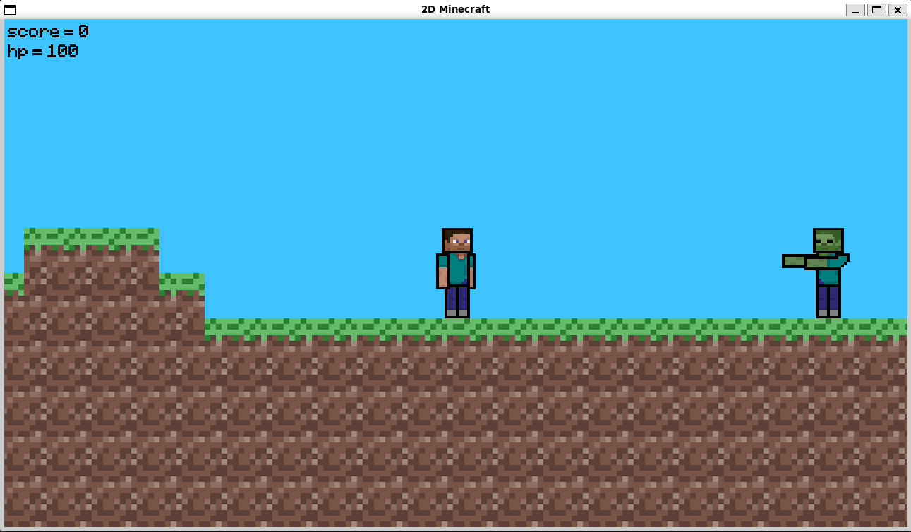

# 2D Minecraft

This is a study project for Programming and Algorithmics 2 course from the 
Faculty of Information Technologies of Czech Technical University. It is a 
simple sandbox game that uses SDL2 library for rendering and event handling 
and resembles 2D version of the popular game Minecraft.

## Gameplay

The player can move left or right, jump, attack enemies, place blocks and 
break blocks. Each block requires certain number of punches to break and 
may have special properties (gas, liquid, deals damage, grants points). 
Enemies move and attack player automatically when near him, lowering his 
health points. Killing an enemy or breaking a block of diamonds grants 
player one point. The game ends when the player gets 5th point or loses 
all health points.

## Running the game

To launch the game you need to have SDL2 runtime libraries installed. Use
`make compile` to get the executable binary file or `make run` to launch it 
with default game map.

## Loading maps

The game can load a `.txt` file representing a game map where numbers 
correspond to certain entity types:

<ol start="0">
  <li>air</li>
  <li>dirt</li>
  <li>grass</li>
  <li>stone</li>
  <li>diamond</li>
  <li>water</li>
  <li>lava</li>
  <li>wolf</li>
  <li>zombie</li>
  <li>player</li>
</ol>

The game saves its state to `.map` files that can also be loaded using command 
line:
- `./2D\ Minecraft` + `[.txt/.map file name]`
- `init.txt` is loaded by default

## Controls

- `LMB` - punch
- `RMB` - place block
- `↑` - jump
- `←` - move left
- `→` - move right
- `Ctrl` + `S` - save game state to `save.map`
